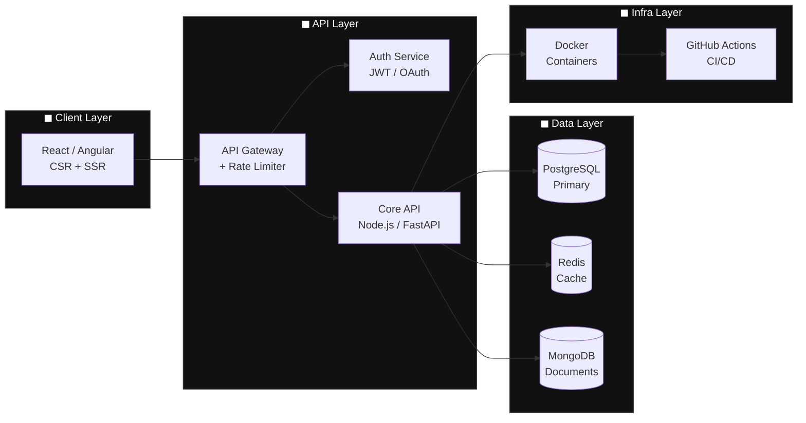

<div align="center">


<br/>

[](https://www.linkedin.com/notifications/?filter=all)
[](https://Kharie01.dev)
[](mailto:kharieladignon01@gmail.com)

</div>

## ◼ Tech Stack

<div align="center">
  


</div>

---

## ◼ About Me

```typescript
const dev = {
  name:     "Kharie Joi B. Ladignon",
  location: "Remote 🌍",
  role:     "Student & Aspiring Full Stack Developer",

  stack: {
    frontend:  ["React", "Angular", "TypeScript", "Tailwind"],
    backend:   ["Node.js", "Python", "FastAPI"],
    devops:    ["Docker", "GitHub Actions"],
    databases: ["PostgreSQL", "MongoDB", "Redis"],
  },

  currentFocus: [
    "Distributed systems at scale",
    "LLM-powered developer tooling",
  ],

  openTo: ["Collaboration", "Open Source", "Learning Opportunities"],
};
```
---

## ◼ GitHub Analytics
<div align="center" width="50%" height="50%">
  
</div>
<br/>


---

## ◼ Contribution Snake

<div align="center">

<picture>
  <source media="(prefers-color-scheme: dark)" srcset="https://raw.githubusercontent.com/Kharie01/Kharie01/output/github-contribution-grid-snake-dark.svg" />
  <source media="(prefers-color-scheme: light)" srcset="https://raw.githubusercontent.com/Kharie01/Kharie01/output/github-contribution-grid-snake.svg" />
  
</picture>

</div>

---

## ◼ System Architecture



---

## ◼ Coding Activity (WakaTime)

<!--START_SECTION:waka-->

<!--END_SECTION:waka-->

---

## ◼ Connect

<div align="center">

```
  ╔────────────────────────────────────────────────╗
  │  Open to collaboration. Let's build together.  │
  ╚────────────────────────────────────────────────╝
```

[](https://www.linkedin.com/notifications/?filter=all)
[](mailto:kharieladignon01@gmail.com)


</div>
