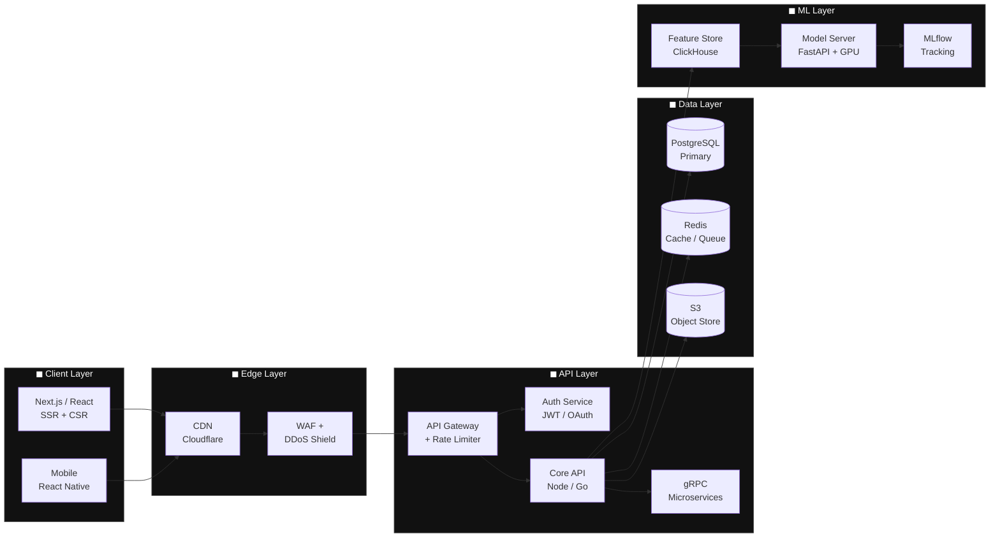

<div align="center">

<!-- Animated Header -->


<!-- Typing Animation -->
<a href="https://git.io/typing-svg">
  
</a>

<br/><br/>

[](https://linkedin.com/in/placeholder)
[](https://twitter.com/placeholder)
[](https://placeholder.dev)
[](mailto:placeholder@email.com)


</div>

---

## ◼ About Me

```typescript
const dev = {
  name:        "Kharie Joi B. Ladignon",
  location:    "Remote 🌍",
  role:        "Student",
  experience:  "none",

  stack: {
    frontend:  ["React", "Angular", "TypeScript", "Tailwind"],
    backend:   ["Node.js", "Python",],
    devops:    ["Docker", "GitHub Actions"],
    databases: ["PostgreSQL", "MongoDB", "Redis"],
  },

  currentFocus: [
    "Distributed systems at scale",
    "LLM-powered developer tooling",
  ],

  openTo:  ["Collaboration"],
};
```

---

## ◼ Tech Stack

<div align="center">

### Languages


### Frontend


### Backend & APIs


### Databases


### Cloud & DevOps


</div>

---

## ◼ GitHub Analytics

<div align="center">
  
  
</div>

<div align="center">
  
</div>

<br/>


---

## ◼ Contribution Snake

<div align="center">

<picture>
  <source media="(prefers-color-scheme: dark)" srcset="https://raw.githubusercontent.com/placeholder/placeholder/output/github-contribution-grid-snake-dark.svg" />
  <source media="(prefers-color-scheme: light)" srcset="https://raw.githubusercontent.com/placeholder/placeholder/output/github-contribution-grid-snake.svg" />
  
</picture>

</div>

<details>
<summary><strong>⚙️ Snake setup — click to expand</strong></summary>

Create `.github/workflows/snake.yml` inside your profile repo (`username/username`):

```yaml
name: Generate Snake Animation
on:
  schedule:
    - cron: "0 */12 * * *"
  workflow_dispatch:
  push:
    branches: [main]
jobs:
  generate:
    runs-on: ubuntu-latest
    steps:
      - uses: Platane/snk/svg-only@v3
        with:
          github_user_name: ${{ github.repository_owner }}
          outputs: |
            dist/github-contribution-grid-snake.svg
            dist/github-contribution-grid-snake-dark.svg?palette=github-dark
      - uses: crazy-max/ghaction-github-pages@v3
        with:
          target_branch: output
          build_dir: dist
        env:
          GITHUB_TOKEN: ${{ secrets.GITHUB_TOKEN }}
```

Then update the image src in this README to use your real username.

</details>

---

## ◼ GitHub Trophies

<div align="center">
  
</div>

---

## ◼ System Architecture



---

## ◼ Coding Activity (WakaTime)

<!--START_SECTION:waka-->
```text
TypeScript   ████████████░░░░░░░░░  11h 44m   44.5 %
Python       ██████░░░░░░░░░░░░░░░   5h 58m   22.6 %
```
<!--END_SECTION:waka-->

<details>
<summary><strong>⚙️ WakaTime auto-update setup</strong></summary>

1. Install the [WakaTime plugin](https://wakatime.com/plugins) for your IDE
2. Add `WAKATIME_API_KEY` as a GitHub Actions secret
3. Add [waka-readme action](https://github.com/athul/waka-readme) to run on schedule

</details>

---

## ◼ Featured Projects

<div align="center">

[](https://github.com/placeholder/flagship-project)
[](https://github.com/placeholder/second-project)

</div>

---

## ◼ Connect

<div align="center">

```
  ╔────────────────────────────────────────────────╗
  │  Open to interesting problems. Let's talk.      │
  │  Consulting · OSS · Talks · Mentorship          │
  ╚────────────────────────────────────────────────╝
```

[](https://linkedin.com/in/placeholder)
[](https://calendly.com/placeholder)
[](mailto:placeholder@email.com)

</div>

---

<div align="center">


</div>
